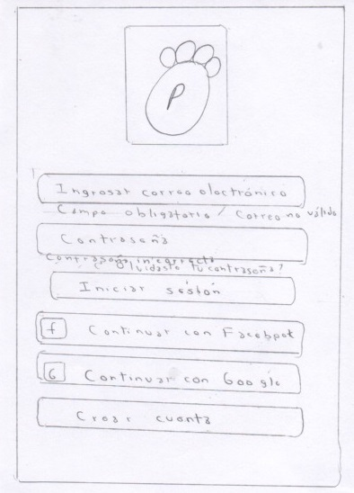
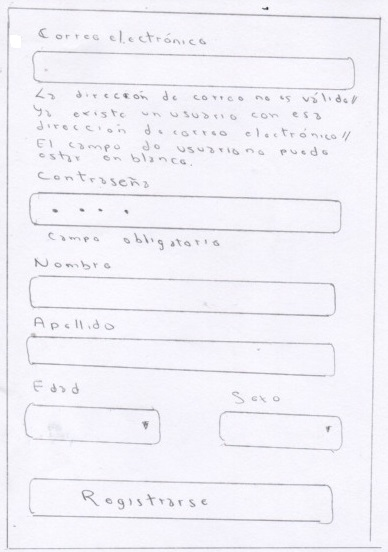
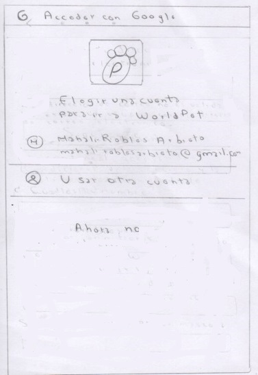
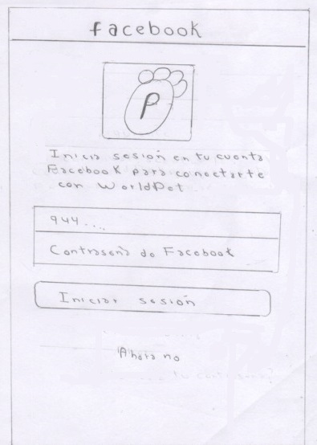

# Creando una Red Social

## Índice

* [Definición del producto](#definición-del-producto)
* [Entrevistas](#entrevistas)
* [Prototipo de baja fidelidad](#prototipo-de-baja-fidelidad)
* [Conclusión de prueba con el producto HTML](#conclusión-de-prueba-con-el-producto-HTML)

## Definición del producto

1. ¿Cuáles son los elementos básicos que tiene una red social?
Permite crear una cuenta personal, permite iniciar sesión, permite hacer publicaciones, permite tener conversaciones con otras personas, permite reaccionar a las personas ante una publicación y filtrar por búsqueda.

2. ¿Quiénes son los principales usuarios del producto?
Personas que estén interesadas en encontrar información de cualquier tipo sobre mascotas.

3. ¿Cómo descubriste las necesidades de los usuarios?
Se descubrió por medio de las entrevistas. Los usuarios argumentaron que hasta el día de hoy no encuentran un Red Social enfocada en mascotas y si bien es cierto en Facebook se puede realizar publicaciones relacionadas a este tipo de temática,estas publicaciones terminan mezclándose con otro tipo de publicaciones originando una dificultad en su búsqueda.

4. ¿Qué problema resuelve el producto para estos usuarios?
La inexistencia de una red social enfocada exclusivamente en mascotas.

5. ¿Cuáles son los objetivos de estos usuarios en relación al producto?
- Poder encontrar publicaciones de mascotas en adopción.
- Poder encontrar publicaciones de mascotas perdidas.
- Poder encontrar personas que ofrezcan servicio para amaestrar mascotas.
- Poder encontrar publicaciones de personas que vendan mascotas.
- Poder encontrar publicaciones de eventos de concursos de mascotas.
- Recordatorio de cumpleaños de mascotas.
- Encontrar promociones de clínicas veterinarias.
- Encontrar publicaciones de posts sobre mascotas.
- Encontrar publicaciones de ventas de accesorios para mascotas.

6. ¿Cuáles son las principales funcionalidades del producto y cuál es su prioridad?
Permite hacer publicaciones, permite crear cuenta, permite ingresar a red social, permite compartir publicaciones, permite hacer autentificación con Facebook o google, reaccionar a las publicaciones, permite la edición o eliminación del post y  permitir al usuario elegir si la visualización del post será de manera pública o privada.

7. ¿Cómo verificaste que el producto les está resolviendo sus problemas?
Mediante los test de usabilidad

8. ¿Cómo te asegurarás que estos usuarios usen este producto?
Haciendo marketing en Facebook, Instagram o ir a centros veterinarios y entregar un logo de nuestra red social. 

## Entrevistas

Entrevista 1

-Ubicación
-Cantidad de recompensa
-Envíe su foto
-Otras personas ofrezcan perros perdidos para que sean adoptados
-Opción que permita donar dinero, alimento o ayuda social, para los que estén teniendo a los perros
-Que me ofrezcan servicio, para no tener que ir al veterinario, servicio médico por internet
-Servicio de como amaestrar un perrito (publicación)
-Que exista una sección de animales perdidos, otro de como adiestrar una mascota, como alimentar, como curar de enfermedades básicas,  veterinario en línea.

Entrevista 2

Color del perro, tipo de raza, estatura, permitir mandar inbox a la persona que hizo la publicación.

Entrevista 3

-Ventas de perro raza, lugares de adopción de mascota, concursos de mascota, brinden información sobre como adiestrar mascota, contacto de gente que sepa adiestrar, 
-Publicaciones
-Encontrar perritos o mascotas para realizar cruce.

Entrevista 4

Que mi cuenta y mis datos personales estén resguardados, que mis publicaciones, solo la vean mis amigos.
Que pueda comunicarme con otros doglovers, que se pueda hacer chats con otras personas.
Que tenga colores coloridos (colores llamativos) y que me transmitan la idea de mascotas.
Que pueda hacer recomendaciones.

Entrevista 5

Que pueda filtrar según el tipo de publicación.
Que pueda acceder a información variada.
Que pueda elegir quienes ven mi publicación.
Que pueda tener un perfil.

Entrevista 6

¿Si hubiera una red social para mascotas, que tipo de información te gustaría encontrar?
-	Adopción
-	Perdida
-	Eventos
-	Promociones
¿Cómo te gustaría visualizar la información?
El usuario respondió que para que la búsqueda sea más rápida le gustaría que la información se visualice de la siguiente manera:
-	La publicación sea agrupada por categorías, siendo estas categorías las mencionadas en la pregunta 1.
-	La publicación se pueda filtrar por el distrito de procedencia, ya que en Facebook todas las publicaciones están mezcladas y a veces encuentra publicaciones que llaman su atención, pero al final es solo para algunos distritos provocándole una desilusión. 

## Prototipo de baja fidelidad

Se realizaron los prototipos de baja fidelidad tomando en cuenta el diseño mobile first

PANTALLA DE INICIO

PANTALLA DE CREACIÓN DE CUENTA CON CORREO Y CONTRASEÑA

AUTENTICACIÓN CON GOOGLE

AUTENTICACIÓN CON FACEBOOK

## Conclusión de prueba con el producto HTML

